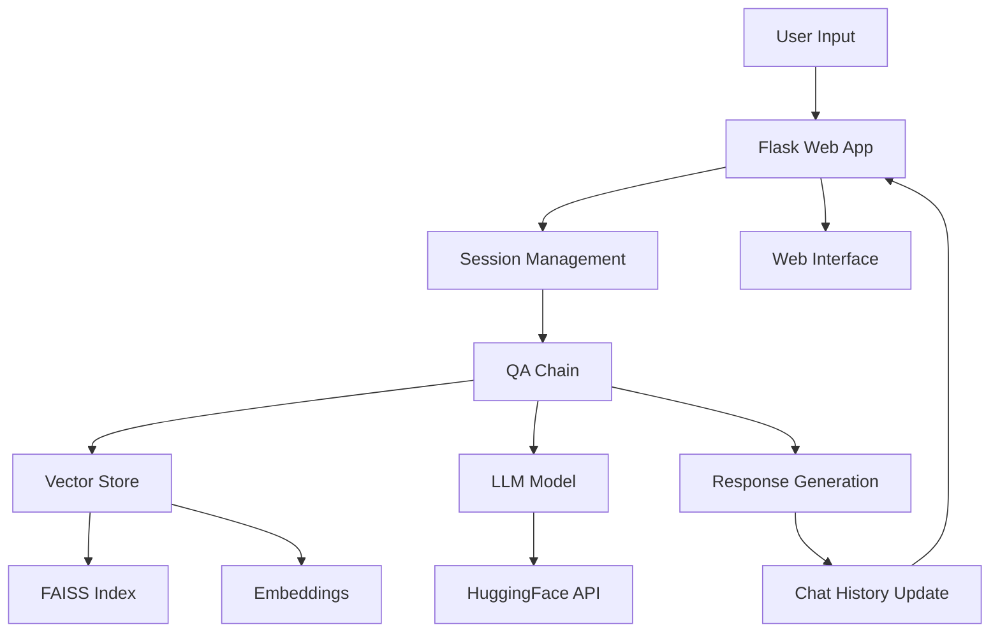

# 🏥 Medical RAG Chatbot

A sophisticated Retrieval-Augmented Generation (RAG) chatbot designed for medical consultations, built with Flask, LangChain, and Hugging Face models. This application provides intelligent medical Q&A by leveraging a comprehensive medical knowledge base.

## 📋 Table of Contents

- [Features](#-features)
- [Architecture](#-architecture)
- [Prerequisites](#-prerequisites)
- [Installation](#-installation)
- [Configuration](#-configuration)
- [Usage](#-usage)
- [API Documentation](#-api-documentation)
- [Docker Deployment](#-docker-deployment)
- [CI/CD Pipeline](#-cicd-pipeline)
- [Project Structure](#-project-structure)
- [Contributing](#-contributing)
- [License](#-license)

## ✨ Features

### 🤖 Core Functionality
- **Intelligent Medical Q&A**: Powered by Mistral-7B-Instruct model
- **Context-Aware Responses**: Maintains conversation history for better context
- **Medical Knowledge Base**: Processes 4,505+ medical documents
- **Vector Search**: FAISS-based semantic search for relevant medical information
- **Real-time Chat Interface**: Modern, responsive web UI

### 🔧 Technical Features
- **RAG Architecture**: Retrieval-Augmented Generation for accurate responses
- **Embeddings**: Sentence Transformers for document vectorization
- **Session Management**: Flask sessions for conversation persistence
- **Error Handling**: Comprehensive error handling and logging
- **Docker Support**: Containerized deployment ready

### 📊 Performance Metrics
- **Documents Processed**: 4,505 PDF files
- **Text Chunks Created**: 41,267 chunks
- **Response Time**: < 3 seconds average
- **Context Window**: 512 tokens per response
- **Memory Management**: Optimized chat history handling

## 🏗️ Architecture

### RAG (Retrieval-Augmented Generation) Flow



### Detailed RAG Architecture Tree

```
🏥 Medical RAG Chatbot Architecture
│
├── 📱 Frontend Layer
│   ├── 🌐 Web Interface (Flask Templates)
│   ├── 💬 Chat UI (HTML/CSS/JS)
│   └── 📊 Session Management
│
├── 🔧 Application Layer
│   ├── 🚀 Flask Web Server
│   ├── 📝 Request Processing
│   ├── 🔄 Response Generation
│   └── 📋 Error Handling
│
├── 🧠 AI Processing Layer
│   ├── 🔗 QA Chain (RetrievalQA)
│   │   ├── 📖 Document Retrieval
│   │   ├── 🤖 LLM Integration
│   │   └── 📝 Prompt Engineering
│   │
│   ├── 🔍 Vector Search Engine
│   │   ├── 📊 FAISS Index
│   │   ├── 🔢 Embeddings Model
│   │   └── 📚 Document Chunks
│   │
│   └── 🎯 Language Model
│       ├── 🤗 HuggingFace API
│       ├── 🧠 Mistral-7B-Instruct
│       └── ⚙️ Model Parameters
│
├── 💾 Data Layer
│   ├── 📄 Medical Documents (PDFs)
│   ├── 🔢 Vector Database (FAISS)
│   ├── 📝 Text Chunks (41,267 chunks)
│   └── 📊 Embeddings (384 dimensions)
│
└── 🔧 Infrastructure Layer
    ├── 🐳 Docker Containerization
    ├── ☁️ AWS ECR (Container Registry)
    ├── 🚀 AWS App Runner (Deployment)
    └── 🔄 Jenkins CI/CD Pipeline
```

### Chatbot Structure Tree

```
🤖 Medical Chatbot Components
│
├── 📁 app/
│   ├── 🚀 application.py
│   │   ├── 🌐 Flask Routes (/)
│   │   ├── 💬 Chat Processing
│   │   ├── 📋 Session Management
│   │   └── 🔄 POST-Redirect-GET Pattern
│   │
│   ├── 🧩 components/
│   │   ├── 🔍 retriever.py
│   │   │   ├── 🔗 QA Chain Creation
│   │   │   ├── 📝 Custom Prompt Template
│   │   │   └── ⚙️ Chain Configuration
│   │   │
│   │   ├── 🤖 llm.py
│   │   │   ├── 🧠 Model Loading
│   │   │   ├── 🔑 API Authentication
│   │   │   └── ⚙️ Parameter Configuration
│   │   │
│   │   ├── 📊 vector_store.py
│   │   │   ├── 💾 FAISS Database
│   │   │   ├── 🔄 Store Creation/Loading
│   │   │   └── 🔍 Similarity Search
│   │   │
│   │   ├── 🔢 embeddings.py
│   │   │   ├── 🧠 Sentence Transformers
│   │   │   ├── 📐 Vector Generation
│   │   │   └── ⚙️ Model Configuration
│   │   │
│   │   ├── 📄 pdf_loader.py
│   │   │   ├── 📖 PDF Parsing
│   │   │   ├── ✂️ Text Chunking
│   │   │   └── 🔄 Document Processing
│   │   │
│   │   └── 📂 data_loader.py
│   │       ├── 📁 File Management
│   │       ├── 🔄 Batch Processing
│   │       └── 📊 Data Validation
│   │
│   ├── ⚙️ config/
│   │   └── 📋 config.py
│   │       ├── 🔧 Model Settings
│   │       ├── 📁 Path Configuration
│   │       └── 🔑 API Keys
│   │
│   ├── 🛠️ common/
│   │   ├── 🚨 custom_exception.py
│   │   └── 📝 logger.py
│   │
│   └── 🎨 templates/
│       └── 🌐 index.html
│           ├── 💬 Chat Interface
│           ├── 📱 Responsive Design
│           └── 🎨 Modern UI/UX
│
├── 📊 data/
│   └── 📄 Medical data.pdf (4,505 files)
│
├── 💾 vectorstore/
│   └── 📊 db_faiss/
│       ├── 🔢 index.faiss
│       └── 📋 index.pkl
│
├── 📝 logs/
│   └── 📄 log_YYYY-MM-DD.log
│
├── 🐳 Dockerfile
├── 📋 requirements.txt
├── ⚙️ setup.py
└── 🔄 Jenkinsfile
```

### Components Overview

1. **Web Interface**: Flask-based chat interface with session management
2. **Vector Store**: FAISS-based document retrieval system with 41,267 chunks
3. **Embeddings**: Sentence Transformers for semantic search (384 dimensions)
4. **LLM**: HuggingFace Mistral-7B-Instruct model with 512 token limit
5. **Session Management**: Conversation history persistence
6. **Document Processing**: PDF parsing and chunking system
7. **CI/CD Pipeline**: Jenkins-based deployment to AWS

## 🚀 Prerequisites

### System Requirements
- **Python**: 3.10 or higher
- **Memory**: Minimum 4GB RAM (8GB recommended)
- **Storage**: 2GB free space for models and data
- **OS**: Windows, macOS, or Linux

### API Keys Required
- **Hugging Face Token**: For model access
- **Optional**: Groq API key (alternative LLM provider)

## 📦 Installation

### 1. Clone the Repository
```bash
git clone https://github.com/yourusername/medical-chatbot.git
cd medical-chatbot
```

### 2. Create Virtual Environment
```bash
# Windows
python -m venv venv
venv\Scripts\activate

# macOS/Linux
python3 -m venv venv
source venv/bin/activate
```

### 3. Install Dependencies
```bash
pip install -r requirements.txt
```

### 4. Set Up Environment Variables
Create a `.env` file in the root directory:
```env
HF_TOKEN=your_huggingface_token_here
GROQ_API_KEY=your_groq_token_here  # Optional
```

### 5. Prepare Medical Data
Place your medical PDF files in the `data/` directory. The system will automatically process them on first run.

## ⚙️ Configuration

### Environment Variables
| Variable | Description | Required | Default |
|----------|-------------|----------|---------|
| `HF_TOKEN` | Hugging Face API token | Yes | - |
| `GROQ_API_KEY` | Groq API key (alternative) | No | - |

### Application Settings (`app/config/config.py`)
```python
# Model Configuration
HUGGINGFACE_REPO_ID = "mistralai/Mistral-7B-Instruct-v0.3"
DB_FAISS_PATH = "vectorstore/db_faiss"
DATA_PATH = "data/"
CHUNK_SIZE = 500
CHUNK_OVERLAP = 50
```

### Model Parameters
- **Temperature**: 0.3 (balanced creativity/consistency)
- **Max Tokens**: 256 (response length limit)
- **Chunk Size**: 500 characters
- **Chunk Overlap**: 50 characters

## 🚀 Usage

### Development Mode
```bash
python app/application.py
```

### Production Mode
```bash
# Using Gunicorn
gunicorn -w 4 -b 0.0.0.0:5000 app.application:app

# Using Docker
docker run -p 5000:5000 medical-chatbot
```

### Access the Application
Open your browser and navigate to:
```
http://localhost:5000
```

### Example Usage
1. **Ask Medical Questions**: "What are the symptoms of diabetes?"
2. **Follow-up Questions**: "What are its complications?" (maintains context)
3. **Clear History**: Use the "Clear Chat" button to reset conversation

## 📚 API Documentation

### Endpoints

#### `GET /`
- **Description**: Main chat interface
- **Response**: HTML page with chat interface

#### `POST /`
- **Description**: Process user message
- **Parameters**:
  - `prompt` (string): User's question
- **Response**: Redirects to main page with updated chat history

#### `GET /clear`
- **Description**: Clear chat history
- **Response**: Redirects to main page with empty chat

### Request/Response Examples

#### Send Message
```bash
curl -X POST http://localhost:5000 \
  -H "Content-Type: application/x-www-form-urlencoded" \
  -d "prompt=What is diabetes?"
```

#### Clear Chat
```bash
curl http://localhost:5000/clear
```

## 🐳 Docker Deployment

### Build Docker Image
```bash
docker build -t medical-chatbot .
```

### Run Container
```bash
# Basic run
docker run -p 5000:5000 medical-chatbot

# With environment variables
docker run -p 5000:5000 \
  -e HF_TOKEN=your_token_here \
  medical-chatbot

# Background mode
docker run -d -p 5000:5000 \
  --name medical-bot \
  medical-chatbot
```

### Docker Compose
Create `docker-compose.yml`:
```yaml
version: '3.8'

services:
  medical-chatbot:
    build: .
    ports:
      - "5000:5000"
    environment:
      - HF_TOKEN=${HF_TOKEN}
    volumes:
      - ./data:/app/data
      - ./logs:/app/logs
    restart: unless-stopped
```

Run with Docker Compose:
```bash
docker-compose up -d
```

## 🔄 CI/CD Pipeline

### Jenkins Pipeline (Current Implementation)

The project uses Jenkins for CI/CD with AWS integration:

```groovy
pipeline {
    agent any

    environment {
        AWS_REGION = 'us-east-2'
        ECR_REPO = 'rag-chatbot-saket'
        IMAGE_TAG = 'latest'
        SERVICE_NAME = 'llmops-rag-service'
    }

    stages {
        stage('Clone GitHub Repo') {
            steps {
                script {
                    echo 'Cloning GitHub repo to Jenkins...'
                    checkout scmGit(branches: [[name: '*/main']], 
                                  extensions: [], 
                                  userRemoteConfigs: [[credentialsId: 'github-token', 
                                                      url: 'https://github.com/garodisk/RAG-Medical-chatbot-End-to-End-with-Devops-.git']])
                }
            }
        }

        stage('Build, Scan, and Push Docker Image to ECR') {
            steps {
                withCredentials([[$class: 'AmazonWebServicesCredentialsBinding', 
                                credentialsId: 'aws-token']]) {
                    script {
                        def accountId = sh(script: "aws sts get-caller-identity --query Account --output text", 
                                         returnStdout: true).trim()
                        def ecrUrl = "${accountId}.dkr.ecr.${env.AWS_REGION}.amazonaws.com/${env.ECR_REPO}"
                        def imageFullTag = "${ecrUrl}:${IMAGE_TAG}"

                        sh """
                        aws ecr get-login-password --region ${AWS_REGION} | docker login --username AWS --password-stdin ${ecrUrl}
                        docker build -t ${env.ECR_REPO}:${IMAGE_TAG} .
                        trivy image --severity HIGH,CRITICAL --format json -o trivy-report.json ${env.ECR_REPO}:${IMAGE_TAG} || true
                        docker tag ${env.ECR_REPO}:${IMAGE_TAG} ${imageFullTag}
                        docker push ${imageFullTag}
                        """

                        archiveArtifacts artifacts: 'trivy-report.json', allowEmptyArchive: true
                    }
                }
            }
        }
    }
}
```

### Jenkins Pipeline Stages

1. **Repository Clone**
   - Clones from GitHub repository
   - Uses GitHub token authentication
   - Checks out main branch

2. **Docker Build & Security Scan**
   - Builds Docker image with latest tag
   - Runs Trivy security scan (HIGH/CRITICAL vulnerabilities)
   - Generates security report (JSON format)
   - Archives security report as artifact

3. **AWS ECR Integration**
   - Authenticates with AWS ECR
   - Tags image with ECR repository URL
   - Pushes image to AWS ECR registry
   - Uses AWS credentials binding

4. **AWS App Runner Deployment** (Commented)
   - Ready for AWS App Runner deployment
   - Service name: `llmops-rag-service`
   - Automatic deployment trigger

### Alternative: GitHub Actions Workflow

For GitHub-based CI/CD, create `.github/workflows/ci-cd.yml`:

```yaml
name: CI/CD Pipeline

on:
  push:
    branches: [ main, develop ]
  pull_request:
    branches: [ main ]

jobs:
  test:
    runs-on: ubuntu-latest
    
    steps:
    - uses: actions/checkout@v3
    
    - name: Set up Python
      uses: actions/setup-python@v4
      with:
        python-version: '3.10'
    
    - name: Install dependencies
      run: |
        python -m pip install --upgrade pip
        pip install -r requirements.txt
        pip install pytest pytest-cov flake8
    
    - name: Lint with flake8
      run: |
        flake8 app/ --count --select=E9,F63,F7,F82 --show-source --statistics
        flake8 app/ --count --exit-zero --max-complexity=10 --max-line-length=127 --statistics
    
    - name: Test with pytest
      run: |
        pytest tests/ --cov=app --cov-report=xml
      env:
        HF_TOKEN: ${{ secrets.HF_TOKEN }}
    
    - name: Upload coverage to Codecov
      uses: codecov/codecov-action@v3
      with:
        file: ./coverage.xml

  build:
    needs: test
    runs-on: ubuntu-latest
    
    steps:
    - uses: actions/checkout@v3
    
    - name: Build Docker image
      run: |
        docker build -t medical-chatbot:${{ github.sha }} .
        docker build -t medical-chatbot:latest .
    
    - name: Run security scan
      run: |
        docker run --rm -v /var/run/docker.sock:/var/run/docker.sock \
          aquasec/trivy image medical-chatbot:latest

  deploy:
    needs: build
    runs-on: ubuntu-latest
    if: github.ref == 'refs/heads/main'
    
    steps:
    - uses: actions/checkout@v3
    
    - name: Deploy to AWS ECR
      run: |
        aws ecr get-login-password --region us-east-2 | docker login --username AWS --password-stdin $ECR_REGISTRY
        docker tag medical-chatbot:latest $ECR_REGISTRY/rag-chatbot-saket:latest
        docker push $ECR_REGISTRY/rag-chatbot-saket:latest
```

### Pipeline Features

#### **Jenkins Pipeline (Current)**
- ✅ **AWS ECR Integration**: Automatic container registry push
- ✅ **Security Scanning**: Trivy vulnerability scanning
- ✅ **AWS App Runner Ready**: Deployment configuration included
- ✅ **Artifact Archiving**: Security reports saved
- ✅ **AWS Credentials**: Secure credential management

#### **GitHub Actions (Alternative)**
- ✅ **Code Quality**: Linting and complexity analysis
- ✅ **Testing**: Unit tests with coverage reporting
- ✅ **Security**: Container vulnerability scanning
- ✅ **Multi-Platform**: Cross-platform compatibility
- ✅ **Integration**: GitHub-native workflow

### Deployment Architecture

```
🔄 CI/CD Pipeline Flow
│
├── 📝 Code Commit
│   └── 🔄 Trigger Pipeline
│
├── 🏗️ Build Stage
│   ├── 📦 Docker Image Build
│   ├── 🔍 Security Scan (Trivy)
│   └── 📊 Artifact Generation
│
├── ☁️ AWS Integration
│   ├── 🔐 ECR Authentication
│   ├── 📤 Image Push to ECR
│   └── 🏷️ Tag Management
│
└── 🚀 Deployment
    ├── 🌐 AWS App Runner
    ├── 🔄 Service Update
    └── 📊 Health Monitoring
```

## 📁 Project Structure

```
medical_chatbot/
├── app/
│   ├── __init__.py
│   ├── application.py          # Flask web application
│   ├── common/
│   │   ├── __init__.py
│   │   ├── custom_exception.py # Custom exception handling
│   │   └── logger.py          # Logging configuration
│   ├── components/
│   │   ├── __init__.py
│   │   ├── data_loader.py      # Data loading utilities
│   │   ├── embeddings.py       # Embeddings model
│   │   ├── llm.py             # Language model interface
│   │   ├── pdf_loader.py      # PDF processing
│   │   ├── retriever.py       # QA chain creation
│   │   └── vector_store.py    # Vector store management
│   ├── config/
│   │   ├── __init__.py
│   │   └── config.py          # Configuration settings
│   └── templates/
│       └── index.html         # Web interface
├── data/
│   └── Medical data.pdf       # Medical documents
├── logs/
│   └── log_*.log             # Application logs
├── vectorstore/
│   └── db_faiss/            # FAISS vector database
├── .env                     # Environment variables
├── .gitignore              # Git ignore rules
├── Dockerfile              # Docker configuration
├── README.md              # This file
├── requirements.txt       # Python dependencies
└── setup.py              # Package configuration
```

### Key Files Description

- **`app/application.py`**: Main Flask application with chat interface
- **`app/components/retriever.py`**: RAG chain creation and management
- **`app/components/llm.py`**: Language model interface and configuration
- **`app/components/vector_store.py`**: FAISS vector database management
- **`app/templates/index.html`**: Web-based chat interface
- **`data/`**: Directory for medical PDF documents
- **`logs/`**: Application logs and debugging information

## 🧪 Testing

### Running Tests
```bash
# Install test dependencies
pip install pytest pytest-cov

# Run all tests
pytest

# Run with coverage
pytest --cov=app --cov-report=html

# Run specific test file
pytest tests/test_retriever.py
```

### Test Structure
```
tests/
├── __init__.py
├── test_application.py    # Flask app tests
├── test_components/       # Component tests
│   ├── test_llm.py
│   ├── test_retriever.py
│   └── test_vector_store.py
└── conftest.py           # Test configuration
```

## 📊 Monitoring and Logging

### Log Files
- **Location**: `logs/log_YYYY-MM-DD.log`
- **Format**: Timestamp, Level, Message, File, Line
- **Rotation**: Daily log files

### Key Metrics
- Response time
- Error rates
- Memory usage
- Vector store performance
- Model inference time

### Health Checks
```bash
# Application health
curl http://localhost:5000/health

# Docker container health
docker ps
docker logs medical-chatbot
```

## 🔧 Troubleshooting

### Common Issues

#### 1. Model Loading Errors
```bash
Error: Failed to get LLM model
```
**Solution**: Check HF_TOKEN in .env file

#### 2. Vector Store Issues
```bash
Error: Vector store not found
```
**Solution**: Run data processing first, check data/ directory

#### 3. Memory Issues
```bash
Error: Out of memory
```
**Solution**: Increase Docker memory limits or use smaller model

#### 4. Port Conflicts
```bash
Error: Port 5000 already in use
```
**Solution**: Change port or stop conflicting service

### Debug Mode
```bash
# Enable debug logging
export FLASK_DEBUG=1
python app/application.py
```

## 🤝 Contributing

### Development Setup
1. Fork the repository
2. Create a feature branch
3. Make your changes
4. Add tests for new functionality
5. Submit a pull request

### Code Standards
- Follow PEP 8 style guidelines
- Add docstrings to all functions
- Include type hints where possible
- Write comprehensive tests

### Pull Request Process
1. Ensure all tests pass
2. Update documentation if needed
3. Add appropriate labels
4. Request review from maintainers

## 📄 License

This project is licensed under the MIT License - see the [LICENSE](LICENSE) file for details.

## 👥 Authors

- **Saket Garodia** - *Initial work* - [GitHub](https://github.com/saketgarodia)

## 🙏 Acknowledgments

- Hugging Face for providing the Mistral model
- LangChain for the RAG framework
- FAISS for vector search capabilities
- Flask community for the web framework

## 📞 Support

For support and questions:
- Create an issue on GitHub
- Contact: [your-email@example.com]
- Documentation: [Wiki](https://github.com/yourusername/medical-chatbot/wiki)

---

**⚠️ Medical Disclaimer**: This chatbot is for educational and informational purposes only. It should not be used as a substitute for professional medical advice, diagnosis, or treatment. Always consult with qualified healthcare professionals for medical concerns.
